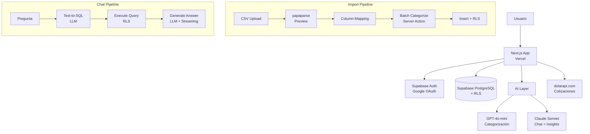
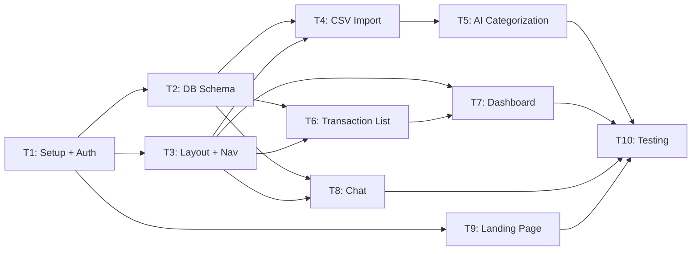

# Spec Técnica — Finanzas AI MVP

**Fecha:** 2026-03-27
**Status:** Draft
**Owner:** Turing 🧠

---

## Arquitectura

### Stack
- **Frontend:** Next.js 15 (App Router) + TypeScript strict + Tailwind CSS + shadcn/ui
- **Backend:** Supabase (Auth + PostgreSQL + RLS + Edge Functions)
- **AI:** Vercel AI SDK + OpenAI GPT-4o-mini (categorización) + Claude Sonnet (chat/insights)
- **Charts:** Tremor (dashboard components)
- **CSV parsing:** papaparse (client-side preview) + server-side validation
- **Deploy:** Vercel
- **Package manager:** pnpm

### System Diagram (Mermaid)



### Module Structure

```
src/
├── app/
│   ├── (auth)/
│   │   ├── login/page.tsx
│   │   └── callback/route.ts
│   ├── (app)/
│   │   ├── layout.tsx           # Auth guard + sidebar
│   │   ├── dashboard/page.tsx
│   │   ├── transactions/page.tsx
│   │   ├── chat/page.tsx
│   │   └── settings/page.tsx
│   ├── api/
│   │   ├── import/route.ts      # CSV processing + AI categorization
│   │   └── chat/route.ts        # Chat streaming endpoint
│   ├── layout.tsx
│   └── page.tsx                 # Landing
├── modules/
│   ├── auth/
│   │   ├── components/          # LoginButton, AuthGuard
│   │   ├── hooks/               # useAuth, useUser
│   │   └── lib/                 # supabase client, middleware
│   ├── transactions/
│   │   ├── components/          # TransactionList, TransactionRow, Filters
│   │   ├── hooks/               # useTransactions, useCategories
│   │   ├── lib/                 # import pipeline, categorization
│   │   └── types/               # Transaction, Category types
│   ├── dashboard/
│   │   ├── components/          # MetricCard, SpendingDonut, MonthlyTrend
│   │   └── hooks/               # useDashboardData
│   ├── chat/
│   │   ├── components/          # ChatWindow, MessageBubble
│   │   ├── hooks/               # useChat
│   │   └── lib/                 # text-to-sql, prompts
│   └── shared/
│       ├── components/          # Sidebar, Header, EmptyState, Modal
│       ├── hooks/               # useSupabase
│       ├── lib/                 # supabase, utils
│       └── types/               # shared types
├── lib/
│   ├── supabase/
│   │   ├── client.ts            # Browser client
│   │   ├── server.ts            # Server client
│   │   └── middleware.ts        # Auth middleware
│   └── ai/
│       ├── categorize.ts        # Categorization pipeline
│       ├── chat.ts              # Chat/text-to-sql pipeline
│       └── prompts.ts           # System prompts
└── styles/
    └── globals.css
```

---

## Data Model

### Schema SQL

```sql
-- Enable UUID extension
CREATE EXTENSION IF NOT EXISTS "uuid-ossp";

-- Accounts (bank accounts, wallets)
CREATE TABLE accounts (
  id UUID PRIMARY KEY DEFAULT uuid_generate_v4(),
  user_id UUID NOT NULL REFERENCES auth.users(id) ON DELETE CASCADE,
  name TEXT NOT NULL,
  type TEXT NOT NULL CHECK (type IN ('checking', 'savings', 'credit', 'cash', 'wallet')),
  currency TEXT NOT NULL DEFAULT 'ARS',
  institution TEXT,
  created_at TIMESTAMPTZ DEFAULT NOW(),
  updated_at TIMESTAMPTZ DEFAULT NOW()
);

-- Categories (system + user custom)
CREATE TABLE categories (
  id UUID PRIMARY KEY DEFAULT uuid_generate_v4(),
  user_id UUID REFERENCES auth.users(id) ON DELETE CASCADE, -- NULL = system category
  name TEXT NOT NULL,
  icon TEXT,
  color TEXT,
  parent_id UUID REFERENCES categories(id),
  is_system BOOLEAN DEFAULT FALSE,
  created_at TIMESTAMPTZ DEFAULT NOW()
);

-- Transactions
CREATE TABLE transactions (
  id UUID PRIMARY KEY DEFAULT uuid_generate_v4(),
  user_id UUID NOT NULL REFERENCES auth.users(id) ON DELETE CASCADE,
  account_id UUID REFERENCES accounts(id),
  amount DECIMAL(12,2) NOT NULL, -- negative = expense, positive = income
  description TEXT NOT NULL,      -- raw from bank
  merchant_name TEXT,              -- parsed/normalized
  category_id UUID REFERENCES categories(id),
  date DATE NOT NULL,
  is_recurring BOOLEAN DEFAULT FALSE,
  ai_confidence FLOAT,            -- LLM confidence score
  user_verified BOOLEAN DEFAULT FALSE,
  import_batch_id UUID,           -- group by import session
  metadata JSONB DEFAULT '{}',
  created_at TIMESTAMPTZ DEFAULT NOW(),
  updated_at TIMESTAMPTZ DEFAULT NOW()
);

-- Merchant aliases (learning cache)
CREATE TABLE merchant_aliases (
  id UUID PRIMARY KEY DEFAULT uuid_generate_v4(),
  user_id UUID REFERENCES auth.users(id) ON DELETE CASCADE, -- NULL = global
  raw_pattern TEXT NOT NULL,
  merchant_name TEXT NOT NULL,
  category_id UUID REFERENCES categories(id),
  created_at TIMESTAMPTZ DEFAULT NOW(),
  UNIQUE(user_id, raw_pattern)
);

-- Import batches (track imports)
CREATE TABLE import_batches (
  id UUID PRIMARY KEY DEFAULT uuid_generate_v4(),
  user_id UUID NOT NULL REFERENCES auth.users(id) ON DELETE CASCADE,
  filename TEXT NOT NULL,
  row_count INTEGER,
  categorized_count INTEGER,
  status TEXT DEFAULT 'processing' CHECK (status IN ('processing', 'completed', 'failed')),
  created_at TIMESTAMPTZ DEFAULT NOW()
);

-- RLS Policies
ALTER TABLE accounts ENABLE ROW LEVEL SECURITY;
ALTER TABLE categories ENABLE ROW LEVEL SECURITY;
ALTER TABLE transactions ENABLE ROW LEVEL SECURITY;
ALTER TABLE merchant_aliases ENABLE ROW LEVEL SECURITY;
ALTER TABLE import_batches ENABLE ROW LEVEL SECURITY;

CREATE POLICY "users_own_accounts" ON accounts USING (auth.uid() = user_id);
CREATE POLICY "users_own_or_system_categories" ON categories USING (user_id IS NULL OR auth.uid() = user_id);
CREATE POLICY "users_own_transactions" ON transactions USING (auth.uid() = user_id);
CREATE POLICY "users_own_or_global_aliases" ON merchant_aliases USING (user_id IS NULL OR auth.uid() = user_id);
CREATE POLICY "users_own_imports" ON import_batches USING (auth.uid() = user_id);

-- Indexes
CREATE INDEX idx_transactions_user_date ON transactions(user_id, date DESC);
CREATE INDEX idx_transactions_user_category ON transactions(user_id, category_id);
CREATE INDEX idx_transactions_import_batch ON transactions(import_batch_id);
CREATE INDEX idx_merchant_aliases_pattern ON merchant_aliases(raw_pattern);
```

### System Categories (seed data)

```
Vivienda: Alquiler, Expensas, Servicios (luz, gas, agua, internet)
Alimentación: Supermercado, Verdulería, Carnicería, Almacén
Delivery: Rappi, PedidosYa, Uber Eats
Transporte: Nafta, SUBE, Uber/Cabify, Estacionamiento, Peajes
Salud: Obra social, Farmacia, Médicos, Odontología
Entretenimiento: Streaming, Cine, Salidas, Juegos
Compras: Ropa, Electrónica, Hogar, Varios
Educación: Cursos, Libros, Materiales
Impuestos: ABL, Patente, Monotributo, Ganancias
Transferencias: Transferencias entre cuentas
Ingresos: Sueldo, Freelance, Otros ingresos
```

---

## AI Pipeline

### Categorización (Import)

```typescript
// lib/ai/categorize.ts

// Step 1: Merchant lookup (free, instant)
function lookupMerchant(description: string, aliases: MerchantAlias[]): Category | null {
  // Check user aliases first, then global
  // regex match against raw_pattern
}

// Step 2: LLM categorization (GPT-4o-mini, batched)
// Batch 20 txns per request for efficiency
// System prompt with category list + examples
// Structured output: { category, subcategory, merchant_name, confidence }

// Step 3: Post-process
// If confidence < 0.5 → mark as "suggested"
// Save new merchant→category mapping to merchant_aliases
```

### Chat (Text-to-SQL)

```typescript
// lib/ai/chat.ts

// Step 1: User question → SQL generation
// System prompt includes: schema, current user_id, available tables
// Uses Claude Sonnet for better SQL generation

// Step 2: Execute SQL with RLS
// The Supabase client has the user's JWT → RLS enforces data isolation

// Step 3: Results → Natural language answer
// Inject query results + original question → streaming response
// Use Vercel AI SDK for streaming to the client
```

---

## API Contracts

### POST /api/import
```typescript
// Request: multipart/form-data with CSV file + column mapping
// Response: { batchId, totalRows, categorizedRows, status }
```

### POST /api/chat
```typescript
// Request: { messages: Message[] }
// Response: ReadableStream (Vercel AI SDK streaming)
```

### Supabase Client Queries
All data queries go through Supabase client with user JWT (RLS enforced).
No custom API routes needed for CRUD — use Supabase client directly.

---

## Task Breakdown

### T1: Project setup + Auth (3h)
- Init Next.js 15 + TypeScript + Tailwind + shadcn/ui + pnpm
- Setup Supabase project (Auth with Google OAuth)
- Auth middleware, login page, callback route, auth guard
- **Files:** app/(auth)/*, lib/supabase/*, modules/auth/*
- **Deps:** none

### T2: Database schema + seed data (2h)
- Create all tables, RLS policies, indexes
- Seed system categories
- Supabase migration files
- **Files:** supabase/migrations/*, lib/supabase/*
- **Deps:** T1

### T3: App layout + navigation (2h)
- Sidebar, header, responsive layout
- Dashboard, Transactions, Chat, Settings page shells
- Empty states
- **Files:** app/(app)/layout.tsx, modules/shared/components/*
- **Deps:** T1

### T4: CSV import pipeline (4h)
- Upload modal with drag & drop
- Client-side CSV preview with papaparse
- Column mapping UI
- Server action: parse + validate + batch insert
- Duplicate detection
- **Files:** modules/transactions/components/Import*, modules/transactions/lib/import*, app/api/import/*
- **Deps:** T2, T3

### T5: AI categorization (3h)
- Merchant lookup table + regex matching
- GPT-4o-mini batch categorization with structured output
- Feedback loop (user correction → merchant_aliases)
- **Files:** lib/ai/categorize.ts, lib/ai/prompts.ts
- **Deps:** T2, T4

### T6: Transaction list + filters (3h)
- Transaction list with infinite scroll
- Filters: category, date range, search text
- Edit category inline
- **Files:** modules/transactions/components/*, modules/transactions/hooks/*
- **Deps:** T2, T3

### T7: Dashboard + charts (3h)
- Metric cards (ingresos, gastos, balance)
- Spending by category donut chart (Tremor)
- Monthly trend line chart (Tremor)
- Month selector
- **Files:** modules/dashboard/components/*, modules/dashboard/hooks/*
- **Deps:** T2, T3, T6

### T8: Chat with finances (4h)
- Chat UI (input + message list + streaming)
- Text-to-SQL pipeline with Claude Sonnet
- Query execution with RLS
- Response generation with streaming (Vercel AI SDK)
- **Files:** modules/chat/*, lib/ai/chat.ts, app/api/chat/*
- **Deps:** T2, T3

### T9: Landing page (2h)
- Hero section + value prop
- Feature highlights
- CTA → login
- SEO meta tags + OG image
- **Files:** app/page.tsx
- **Deps:** T1

### T10: Testing + Polish (3h)
- Vitest unit tests for AI pipeline, import parsing, utils
- Playwright E2E for critical flows (auth, import, dashboard, chat)
- Mobile responsive check
- Error handling + loading states
- **Files:** __tests__/*, e2e/*
- **Deps:** T1-T9

**Total estimado: ~29 horas**

### Dependency Graph



### Parallelism Plan

```
Wave 1: T1 (setup + auth)
Wave 2: T2 (DB) + T3 (layout) + T9 (landing) — 3 parallel
Wave 3: T4 (import) + T6 (transactions) + T8 (chat) — 3 parallel
Wave 4: T5 (AI categorization) + T7 (dashboard) — 2 parallel
Wave 5: T10 (testing + polish)
```
